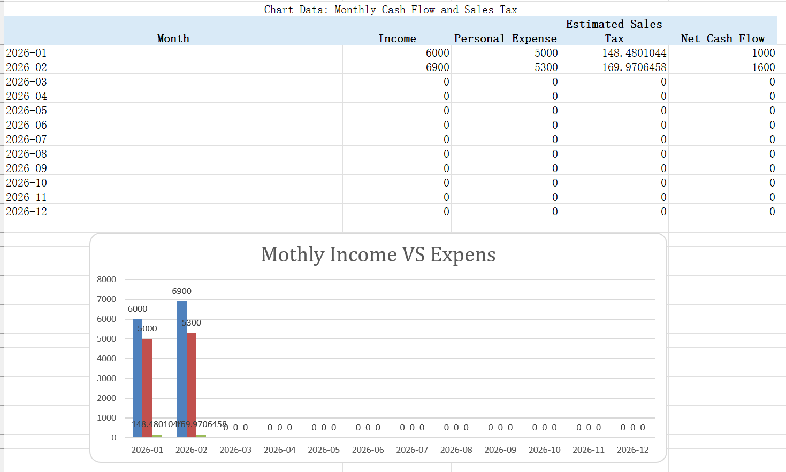
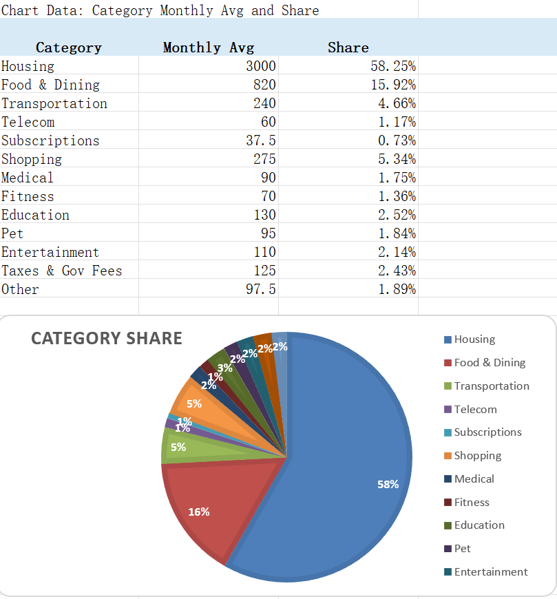

# Personal Finance Excel BI Template

A bilingual Excel template for tracking personal income, expenses, sales tax, emergency funds, and investable cash.

This project is built for people who want a simple monthly input workflow and an Excel dashboard that summarizes personal spending patterns.

## Download

| Version | File |
|---|---|
| English | `templates/Personal_Finance_Template_2026_EN.xlsx` |
| Chinese | `templates/Personal_Finance_Template_2026_ZH.xlsx` |

Open either workbook in Microsoft Excel, enter your own monthly records, and review the summary sheets.

## Preview

### Monthly income, expense, sales tax, and net cash flow



This view compares monthly income and personal expenses. It also shows estimated sales tax and net cash flow.

### Category average and spending share



This view shows average monthly spending by category and the share of each category in total personal expenses.

## How to use

1. Download the English or Chinese Excel template from the `templates/` folder.
2. Open the workbook in Microsoft Excel.
3. Enter monthly expenses in the expense input sheet.
4. Enter monthly income in the income input sheet.
5. Update the settings sheet if your cash reserve or risk preference changes.
6. Review monthly summary, category summary, emergency fund, and investable cash results.

## Example data

The workbook includes Month 1 and Month 2 sample data. These sample records show how personal expenses and income can be entered.

CSV examples are also available in:

```text
examples/sample_data_jan_feb/
```

You can replace the sample data with your own records.

## What the workbook tracks

- monthly income and personal expenses;
- spending by category;
- estimated GST/QST sales tax;
- monthly net cash flow;
- annual spending projection;
- emergency fund requirement;
- investable cash after keeping a safety reserve.

## Privacy note

This repository is designed for templates and anonymized sample data. Keep real bank records, account balances, tax documents, and personal screenshots outside a public repository.

## Disclaimer

This workbook is a personal finance analysis tool. It is not tax, legal, accounting, or investment advice.
