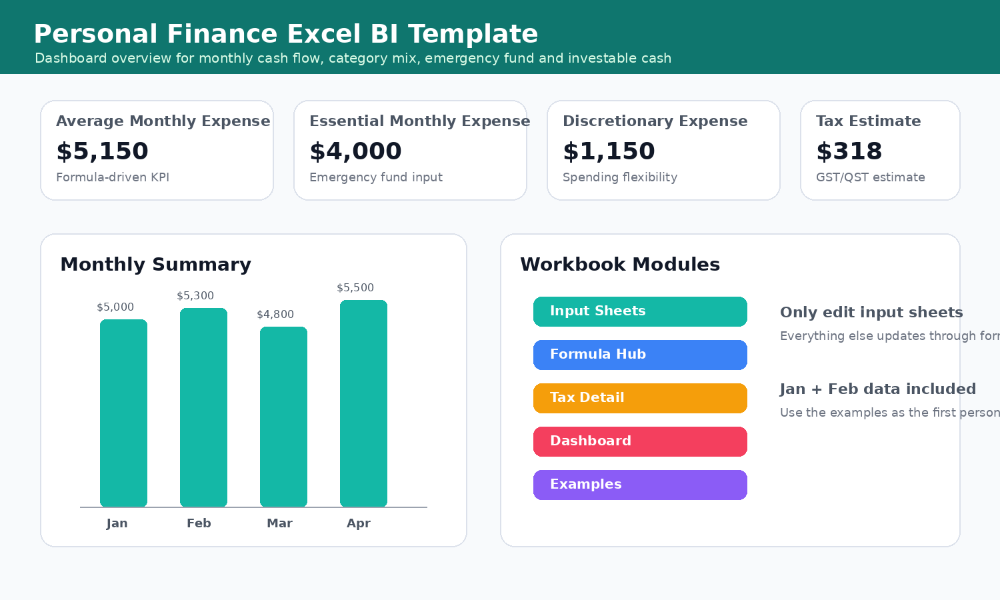
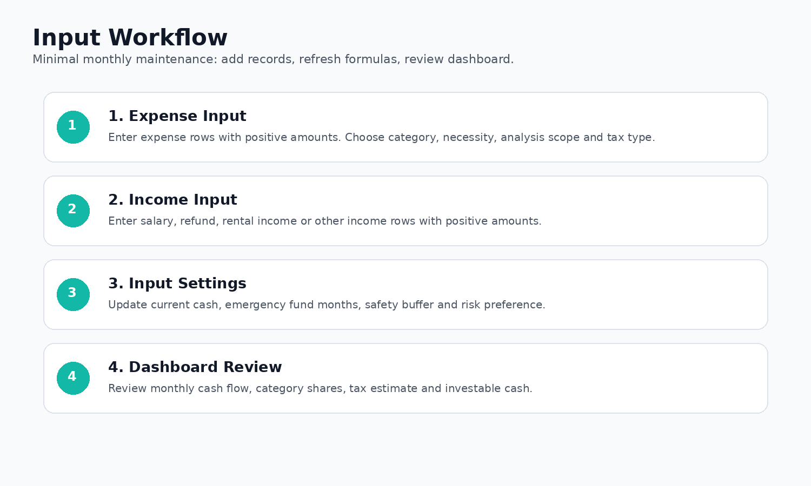
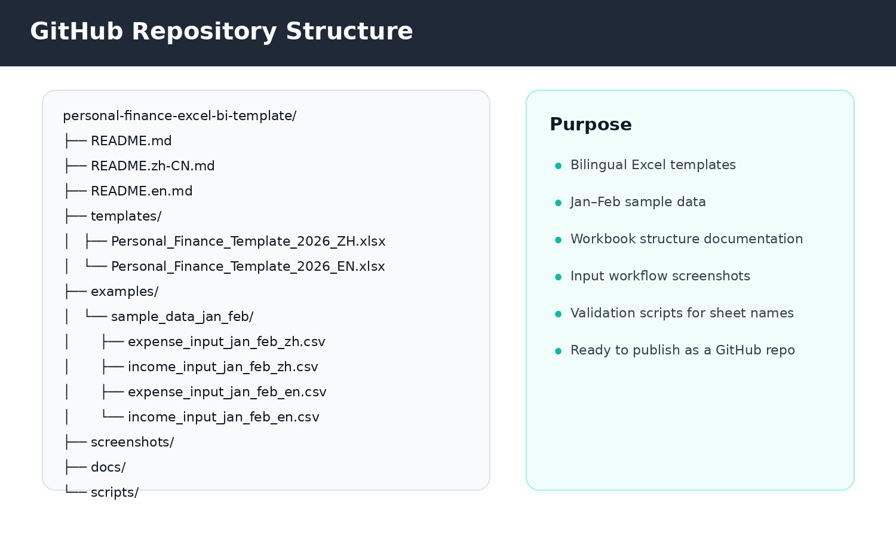

# 个人财务 Excel BI 分析模板

这是一个中英双语的个人财务 Excel 项目，用于月度记账、消费结构分析、加拿大 GST/QST 消费税估算、备用金测算，以及可投资资金判断。



## 这个项目在做什么

这个仓库把个人 Excel 记账表整理成一个可以长期复用的财务分析模板。它的核心目标是：**输入尽量少，分析尽量完整**。

核心功能：

- 记录每月支出与收入，金额统一填写正数；
- 区分个人支出、出租房现金流、内部转账、投资转账；
- 自动汇总月度现金流与各类别支出；
- 按 Lean / Normal / Conservative 三种情景估算全年消费；
- 计算 3 / 6 / 12 个月备用金；
- 在保留安全储备后估算可投资资金；
- 按加拿大 GST/QST 逻辑估算日常消费税影响。

## 模板文件

| 文件 | 语言 | 用途 |
|---|---|---|
| `templates/Personal_Finance_Template_2026_ZH.xlsx` | 中文 | 中文原版模板 |
| `templates/Personal_Finance_Template_2026_EN.xlsx` | 英文 | 完全英文改版模板 |

## 示例数据说明

模板中已经放入了**第一个月和第二个月的示例数据**。这些数据可以作为个人数据输入的格式参考。你可以直接替换为自己的真实记录，也可以保留示例作为输入样板。

对应 CSV 示例也放在：

```text
examples/sample_data_jan_feb/
```



## 仓库结构



```text
personal-finance-excel-bi-template/
├── README.md
├── README.zh-CN.md
├── README.en.md
├── templates/
├── examples/sample_data_jan_feb/
├── screenshots/
├── docs/
└── scripts/
```

## 工作簿模块

| Chinese Sheet | English Sheet | Purpose |
|---|---|---|
| `使用说明` | `Instructions` | How to use the workbook and monthly maintenance rules. |
| `总览` | `Dashboard` | Main dashboard for cash flow, spending, reserves and investable cash. |
| `总支出` | `Expense_Input` | Primary expense input table. Enter all expenses as positive amounts. |
| `总收入` | `Income_Input` | Primary income input table. Enter all income as positive amounts. |
| `输入设置` | `Input_Settings` | Manual settings such as current cash, reserve months and risk preference. |
| `税费设置` | `Sales_Tax_Settings` | GST/QST assumptions and taxability rules. |
| `每月总结` | `Monthly_Summary` | Monthly income, expense and cash-flow summary. |
| `各类别总结` | `Category_Summary` | Category-level monthly average, annualized amount and share of spending. |
| `消费税分析` | `Sales_Tax_Analysis` | Monthly GST/QST estimate and tax analysis. |
| `公式枢纽` | `Formula_Hub` | Central formula hub used by the dashboard and summary sheets. |
| `税费计算明细` | `Sales_Tax_Detail` | Line-by-line before-tax, GST, QST and after-tax calculation detail. |
| `年度消费预测` | `Annual_Projection` | Lean / Normal / Conservative annual spending projections. |
| `保障金分析` | `Emergency_Fund` | Emergency fund calculator for 3, 6 and 12 months. |
| `可投资资金` | `Investable_Cash` | Investable cash estimate after reserve requirements. |
| `公式说明` | `Formula_Notes` | Formula notes and maintenance rules. |
| `选项` | `Lists` | Dropdown lists and category dictionaries. |

## 快速使用

1. 从 `templates/` 下载中文或英文模板。
2. 用 Excel 打开工作簿。
3. 日常只填写输入页：总支出、总收入、输入设置、税费设置。
4. 支出与收入金额都填写正数。
5. 参考第一个月和第二个月示例数据的格式录入个人记录。
6. 查看总览、每月总结、各类别总结、保障金分析、可投资资金等页面。
7. 如果把仓库发布到 GitHub，请把真实个人交易记录保存在仓库外部。

## 隐私提醒

个人财务数据属于敏感信息。这个仓库适合公开模板和匿名示例；真实银行流水、税务文件、账户余额、截图建议放在本地私有文件夹或私有仓库。

## 免责声明

这个工作簿是个人财务分析工具，并非税务、法律、会计或投资建议。涉及实际报税、投资配置和税务处理时，请结合专业人士意见。


---

# Personal Finance Excel BI Template

A bilingual Excel-based personal finance analysis project for monthly bookkeeping, spending analysis, Canadian GST/QST estimation, emergency fund planning and investable cash judgment.


## What this project does

This repository turns a personal Excel workbook into a reusable finance-analysis template. It is designed for people who want to keep the input process simple while still getting dashboard-style outputs.

Core functions:

- record monthly expenses and income with positive amounts;
- separate personal expenses, rental-property cash flow, transfers and investment-related movements;
- summarize monthly cash flow and category spending;
- estimate annual spending under Lean, Normal and Conservative scenarios;
- calculate emergency-fund requirements;
- estimate investable cash after keeping a safety reserve;
- estimate Canadian GST/QST impact for daily consumption categories.

## Templates included

| File | Language | Use |
|---|---|---|
| `templates/Personal_Finance_Template_2026_ZH.xlsx` | Chinese | Original Chinese template |
| `templates/Personal_Finance_Template_2026_EN.xlsx` | English | Fully translated English template |

## Example data

The workbook already includes **Month 1 and Month 2 sample data**. These sample records are provided as starter examples for personal data input. You can replace them with your own records, or keep them as a format reference.

CSV versions are also provided under:

```text
examples/sample_data_jan_feb/
```


## Repository structure


```text
personal-finance-excel-bi-template/
├── README.md
├── README.zh-CN.md
├── README.en.md
├── templates/
├── examples/sample_data_jan_feb/
├── screenshots/
├── docs/
└── scripts/
```

## Workbook modules

| Chinese Sheet | English Sheet | Purpose |
|---|---|---|
| `使用说明` | `Instructions` | How to use the workbook and monthly maintenance rules. |
| `总览` | `Dashboard` | Main dashboard for cash flow, spending, reserves and investable cash. |
| `总支出` | `Expense_Input` | Primary expense input table. Enter all expenses as positive amounts. |
| `总收入` | `Income_Input` | Primary income input table. Enter all income as positive amounts. |
| `输入设置` | `Input_Settings` | Manual settings such as current cash, reserve months and risk preference. |
| `税费设置` | `Sales_Tax_Settings` | GST/QST assumptions and taxability rules. |
| `每月总结` | `Monthly_Summary` | Monthly income, expense and cash-flow summary. |
| `各类别总结` | `Category_Summary` | Category-level monthly average, annualized amount and share of spending. |
| `消费税分析` | `Sales_Tax_Analysis` | Monthly GST/QST estimate and tax analysis. |
| `公式枢纽` | `Formula_Hub` | Central formula hub used by the dashboard and summary sheets. |
| `税费计算明细` | `Sales_Tax_Detail` | Line-by-line before-tax, GST, QST and after-tax calculation detail. |
| `年度消费预测` | `Annual_Projection` | Lean / Normal / Conservative annual spending projections. |
| `保障金分析` | `Emergency_Fund` | Emergency fund calculator for 3, 6 and 12 months. |
| `可投资资金` | `Investable_Cash` | Investable cash estimate after reserve requirements. |
| `公式说明` | `Formula_Notes` | Formula notes and maintenance rules. |
| `选项` | `Lists` | Dropdown lists and category dictionaries. |

## Quick start

1. Download either the Chinese or English template from `templates/`.
2. Open the workbook in Excel.
3. Edit only the input sheets: Expense Input, Income Input, Input Settings and Sales Tax Settings.
4. Keep amounts positive in both income and expense tables.
5. Use Month 1 and Month 2 examples as input patterns.
6. Review the Dashboard, Monthly Summary, Category Summary, Emergency Fund and Investable Cash sheets.
7. When publishing this repository publicly, keep real personal transactions out of GitHub.

## Privacy note

Personal finance data is sensitive. This repository is structured to publish templates and anonymized examples only. Keep real bank records, tax documents, screenshots and account balances in a private folder outside the repository.

## Disclaimer

This workbook is a personal finance analysis tool. It is not professional tax, legal, accounting or investment advice. Verify tax treatment and investment decisions with qualified professionals when needed.
