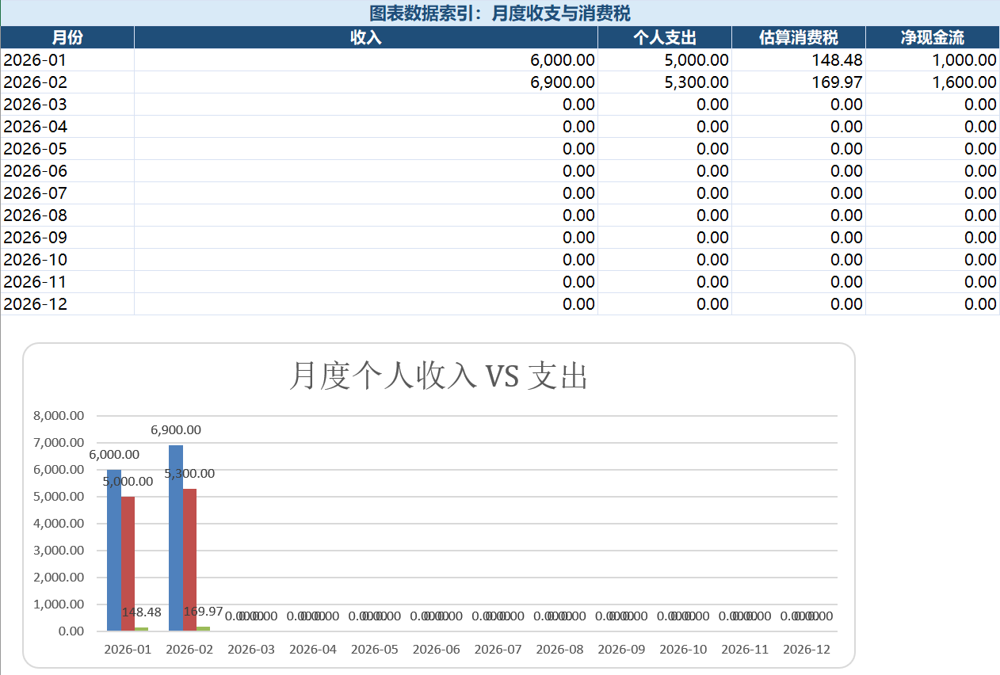
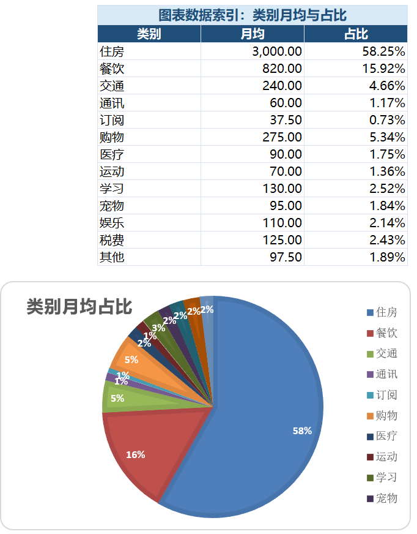

# 个人财务 Excel 分析模板

这是一个中英双版 Excel 模板，用于记录个人收入、支出、消费税、备用金和可投资现金。

这个项目适合想要用简单方式录入月度数据，并通过 Excel 总览页查看消费结构的人。

## 下载

| 版本 | 文件 |
|---|---|
| 英文版 | `templates/Personal_Finance_Template_2026_EN.xlsx` |
| 中文版 | `templates/Personal_Finance_Template_2026_ZH.xlsx` |

用 Microsoft Excel 打开任一模板，填入自己的月度记录，然后查看汇总页面。

## 预览

### 月度收入、支出、消费税和净现金流



这个视图用于对比每月收入和个人支出，并展示估算消费税和净现金流。

### 类别月均和支出占比



这个视图用于展示各类别的月均支出，以及每个类别在总个人支出中的占比。

## 使用方法

1. 从 `templates/` 文件夹下载英文版或中文版 Excel 模板。
2. 用 Microsoft Excel 打开工作簿。
3. 在支出输入页录入每月支出。
4. 在收入输入页录入每月收入。
5. 现金储备或风险偏好变化时，更新设置页。
6. 查看每月汇总、类别汇总、备用金和可投资现金结果。

## 示例数据

工作簿中已经包含第一个月和第二个月的示例数据。这些记录用于展示个人支出和收入的录入格式。

CSV 示例也放在：

```text
examples/sample_data_jan_feb/
```

你可以用自己的记录替换示例数据。

## 工作簿可以分析什么

- 月度收入和个人支出；
- 各类别支出；
- GST/QST 消费税估算；
- 月度净现金流；
- 年度支出预测；
- 备用金需求；
- 保留安全储备后的可投资现金。

## 隐私提醒

这个仓库适合公开模板和匿名示例数据。真实银行记录、账户余额、税务文件和个人截图建议保存在公开仓库之外。

## 免责声明

这个工作簿是个人财务分析工具，并非税务、法律、会计或投资建议。
